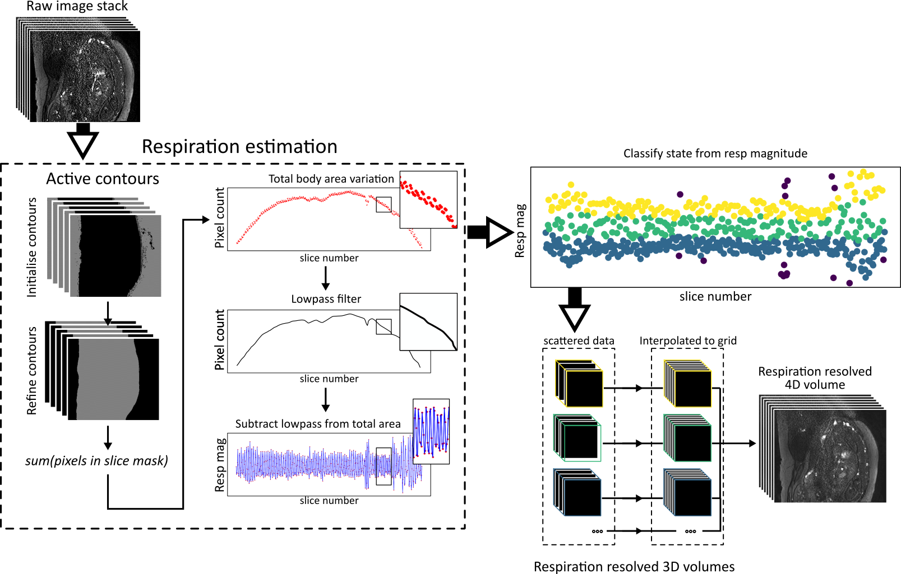
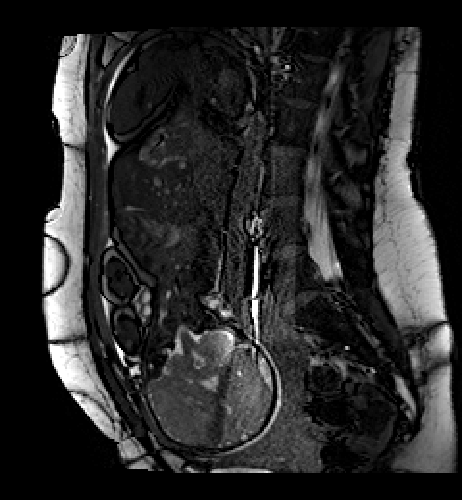
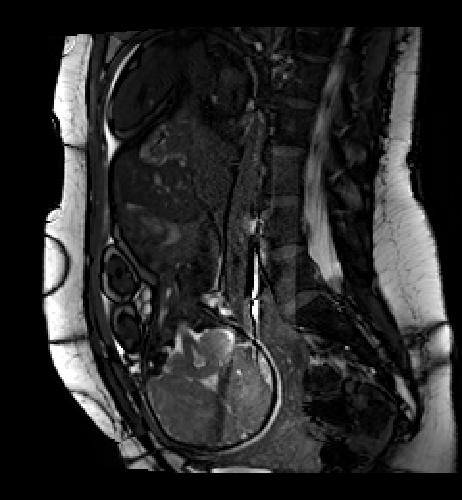
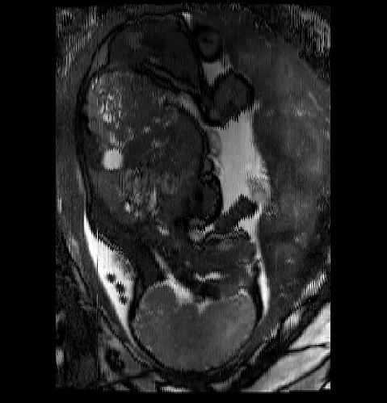
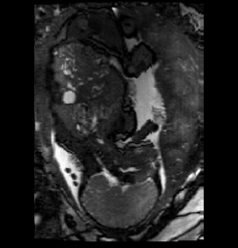
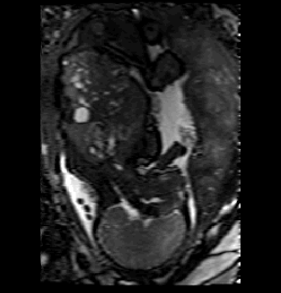

# SWEEP reconstruction

---
## Introduction
This repository contains reconstruction code for respiration resolved reconstruction of dynamic 2D MRI images. Although the code is described in the context of a SWEEP acquisition is it applicable to any sequence of 2D images acquired in a linear (ascending or descending) order. The code presented here builds upon the reconstruction pipeline described in the paper below. If you find this code useful please acknowledge this paper. 
 
> Jackson, LH, Price, AN, Hutter, J et al. Respiration resolved imaging with continuous stable state 2D acquisition using linear frequency SWEEP. Magn Reson Med. 2019; 00: 1– 15. https://doi.org/10.1002/mrm.27834 

This work was performed as part of the [Placenta Imaging Project (PIP)](https://placentaimagingproject.org/project/) part of the NIH [Human Placenta Project](https://www.nichd.nih.gov/research/supported/HPP/default). 

An outline of the reconstruction pipeline is given in the figure below. For more details please refer to the paper given above.

The pipeline performs the following functions.
1. Sort image data (dynamic 4D data converted to interleaved 3D)
2. Estimate respiration and classify slices into respiration states
3. Resample image data into isotropic respiration resolved volumes

### Example
The software takes as an input a dense stack of rapid-acquisition 2D images that are acquired fast enough to freeze in plane motion, but suffer from motion corruption in the through plane direction.

An example reconstruction using this software is given below. The data shows a rapid 2D bSSFP acquisition utilising the SWEEP method for fetal/placental imaging. The figure below shows how the method is able to effectively correct for respiration induced motion and recover the temporal information (maternal respiration) while suppressing motion artefacts. 

The left column images shows the raw input data, the data is static and shows no motion in the acquisition plane (top row) and motion corruption in the through plane direction (bottom row). After reconstruction with the `fast_linear` interpolation method the motion is corrected and the temporal component recovered (middle column). Using the slower `rbf` resampling method a smoother result is obtained (right column).

  
   
  

  
   
  

## Installation
The code was developed in python 3.5 on a windows machine running [Anaconda](https://www.anaconda.com/) and makes us of a number of 3rd party libraries (see requirements.txt), it is necessary to install these before running the code. 

To view the output an image viewer which preserves NIfTI geometry is required - I recommend [MITK workbench](http://mitk.org/wiki/Downloads)

#### Optional
It is recommended that you set up a new virtual environment to contain the code and dependencies: 
~~~~
python -m venv sweep_venv
source sweep_venv/lib/activate
~~~~
or if using conda:
~~~~
conda create --name sweep_venv
conda activate sweep_venv
~~~~

#### Setup
Clone the repository to your local machine and install module dependencies: 
~~~~
git clone https://github.com/laurencejackson/sweep_reconstruction.git
cd sweep_reconstruction
python -m pip install -r requirements.txt
~~~~

## Usage
The code is written in a modular fashion. The full pipeline can be performed by running the `__main.__.py` function, or by pointing the python interpreter to the directory e.g. `python /path/to/sweep_reconstruction`. Alternatively, the three individual stages of the pipeline described above can be run through the `run_<function_name>.py ` scripts in the root directory. 

An example dataset is included in `data/example_SWEEP_data.nii.gz` to demonstrate the function of the code.

Note that when the code runs it saves output images and log data to the current working directory, so make sure you navigate to a location where you wish to save the output. 

The code runs fairly fast <1min using the default options. If you choose to use the option `--interpolation gpr` the output will be more accurate and smoother, but will take significantly longer (approx 7 hours on 4 threads). Note also that the code is capable of parallel execution on multi-core CPUs. By default this runs on one less than the maximum cpu thread count to allow the code to run in the background. If running the code remotely where this is not important then modify the `cores` variable in ResampleData and EstimateRespiration to use all available threads.

### Running the full pipeline
Help information can be printed by running the function and passing the -h, --help argument e.g. `python /sweep_reconstruction -h`

~~~~
usage: sweep_recon [-h] -i  [-t] [-n] [-r] [-c]

Reconstruct respiration resolved dynamic SWEEP MRI data

optional arguments:
  -h, --help          show this help message and exit
  -t , --thickness    thickness of acquired slice [mm] [default: 2.5]
  -n , --nstates      number of respiration states [default: 4]
  -r, --redo          redo all steps with given arguments [default: False]
  -c, --disable_crop  disable automatic cropping of data to respiration
                      regions [default: False]

required arguments:
  -i , --input        path to input file
~~~~
  
Usage example for running the full pipeline
~~~~
path_to_repo='~/sweep_reconstruction' # edit to match path to cloned repo

# Create test directory and copy data
mkdir sweep_test_dir/test_data

# copy data and navigate to directory
cp ${path_to_repo}/data/example_SWEEP_data.nii.gz ~/sweep_test_dir/test_data/example_SWEEP_data.nii.gz
cd sweep_test_dir

# run
python ${path_to_repo} -i test_data/example_SWEEP_data.nii.gz
~~~~
Note that the code is capable of parallel execution on multi-core CPUs. By default this runs on N = cpu_count - 1 cores to allow the code to run in the background if running the code remotely where this is not important then modify the `cores` variable in ResampleData and EstimateRespiration to use all available threads.

### Running individual modules
Help information for individual functions can be printed by running the function and passing the -h, --help argument e.g. `python /sweep_reconstruction/run_sort_image_data.py -h`

~~~~
usage: run_sort_image_data.py [-h] -i  [-r]

Sorts image data from 4D slice+dynamics to 3D with by interleaving the
dynamics with the slice positions

optional arguments:
  -h, --help     show this help message and exit
  -r, --redo     redo all steps with given arguments [default: False]

required arguments:
  -i , --input   path to input file
~~~~
  
Usage example for running individual functions (e.g. `run_sort_image_data`)
~~~~
path_to_repo='~/sweep_reconstruction' # edit to match path to cloned repo

# Create test directory and copy data
mkdir sweep_test_dir/test_data

# copy data and navigate to directory
cp ${path_to_repo}/data/example_SWEEP_data.nii.gz ~/sweep_test_dir/test_data/example_SWEEP_data.nii.gz
cd sweep_test_dir

# run
python ${path_to_repo}/run_sort_image_data.p -i test_data/example_SWEEP_data.nii.gz
~~~~

## License
The software is distributed under the MIT license, see the LICENSE file for details.
